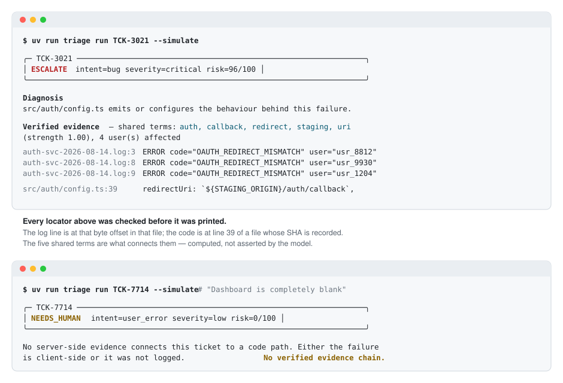
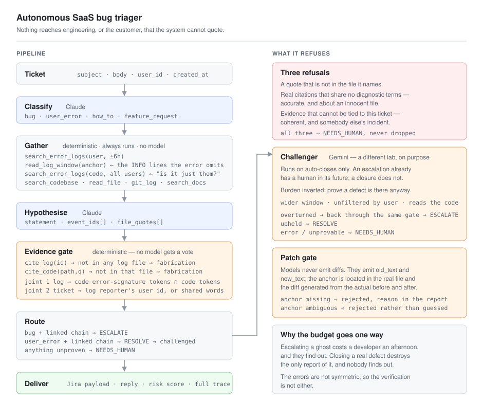

## Autonomous SaaS Bug Triager

An autonomous Level 1 support engineer. It reads an inbound ticket, searches real
service logs and a real source tree, states a root cause, drafts a candidate
patch, and either escalates it to a tracker or answers the customer and closes.

It is built around one constraint: **nothing reaches engineering, or the
customer, that the system cannot quote.**


---

## Why This Matters:

* **Escalations arrive with evidence, not opinions.** Every log line and every
  line of code in a raised issue was verified against the file it names before
  the issue existed.
* **Real defects stop getting closed.** Every proposed auto-close is challenged
  by a second model from a different lab, with the burden of proof inverted.
* **Auditable and mostly deterministic.** Retrieval, citation checking, severity,
  risk scoring, and patch validation are plain Python. Only the reasoning is a
  model.

---

## The problem

An L1 triage agent produces two outputs that cost real money: an **escalation**,
which spends engineering time, and a **resolution**, which closes a customer's
ticket. A language model produces the wrong one in exactly the same confident
register as the right one.

The two errors are not symmetric.

**Escalating a ghost** — a detailed, plausible RCA blaming a file that has
nothing to do with the symptom, costs a developer an afternoon. It is expensive,
and it is *self-correcting*: they open it, find nothing, and say so.

**Closing a real defect** — a help article, a polite reply, a shut ticket — costs
almost nothing today. It is also *terminal*. Nobody looks again. The bug persists
and the only report of it has been destroyed.

**So this system treats both of its own conclusions as untrusted, and spends its
verification budget on the irreversible one.** No escalation is allowed without
citations that resolve against real files and demonstrably connect to the
symptom. No ticket is closed as "working as intended" until a different model,
from a different lab, has tried and failed to prove a defect is there.

---

## Backend Demonstration



Try it out! (no API key required):

```bash
uv run triage run TCK-3021 --simulate --verbose
uv run triage run TCK-7714 --simulate
```

## Interface Demonstration (Click for better visual experience)

| [## Live &rarr;](https://rhain-r.github.io/autonomous-saas-triager/assets/showcase.html)** | A guided walkthrough  |
| --- | --- |
| [## Console &rarr;](https://rhain-r.github.io/autonomous-saas-triager/assets/console.html)** | The work behind the scene |

Source: [`assets/showcase.html`](assets/showcase.html) &middot;
[`assets/console.html`](assets/console.html)


## Architecture



<details>
<summary>Text version</summary>

```
[ Ticket ]
     │
     ▼
[ Classify ]  Claude → bug | user_error | how_to | feature_request
     │
     ▼
[ Gather ]  deterministic, always runs, no model in the loop
     ├─ search_error_logs(user, ±6h)        the reporter's own failures
     ├─ read_log_window(anchor)             the INFO lines the error omits
     ├─ search_error_logs(code, all users)  "is it just them?" → blast radius
     └─ search_codebase · read_file · git_log · search_docs
     │
     ▼
[ Hypothesise ]  Claude → statement + event_ids[] + file_quotes[]
     │
     ▼
[ Evidence gate ]  deterministic
     ├─ cite_log / cite_code   ─► not in the file ⇒ recorded as a fabrication
     ├─ joint 1  log → code    ─► error-signature tokens ∩ code tokens
     └─ joint 2  ticket → log  ─► reporter's user id, or shared vocabulary
     │
     ▼
[ Route ]  bug + proof ⇒ escalate · user_error + proof ⇒ resolve
           anything unproven ⇒ needs_human
     │
     ▼
[ Challenger ]  Gemini, on auto-closes only, burden inverted
     ├─ overturned (through the same gate) ⇒ escalate
     ├─ upheld                             ⇒ resolve
     └─ error / unprovable                 ⇒ needs_human
     │
     ▼
[ Patch gate ]  old_text located in the real file ⇒ diff generated here
     │
     ▼
[ Deliver ]  Jira payload · customer reply · risk score · full trace
```

</details>

---

## Challenges Solved

* **Confident misattribution.** A model that greps `auth`, lands on
  `src/auth/session.ts`, and quotes it *accurately* has produced a perfect
  citation for an innocent file.
  * *Solution:* **A two-joint evidence chain.** Real citations are not enough.
    The error signature's tokens must intersect the cited code's tokens
    (`redirect_uri` in a log matches `redirectUri` in source), *and* the cited
    events must tie back to this ticket. Both computed in Python; a model can
    assert a connection but cannot assert the overlap that proves one.
<br></br>
* **The lazy close.** The cheapest action is to match a help-centre article and
  shut the ticket — and the article is often the *specification the product is
  violating*, not the answer.
  * *Solution:* **An adversarial challenger** on a different provider, told to
    assume the first agent was lazy. It gets a wider log window, unfiltered by
    user, and reads the code path the customer described. Its own citations go
    back through the same gate.
<br></br>
* **Patches that apply to nothing.** Models hallucinate diff context and
  mis-count hunk offsets, and a plausible non-applying patch looks like work
  until an engineer tries it.
  * *Solution:* **Models never emit diffs.** They emit `old_text` / `new_text`;
    `agent/patcher.py` locates the anchor in the real file, refuses it if missing
    or ambiguous, and generates the diff itself. It applies by construction.
<br></br>
* **Self-contradictory output.** Agents cheerfully return `disposition=escalate`
  with no evidence, or `intent=bug` alongside `disposition=resolve`.
  * *Solution:* **Schema-enforced integrity.** Pydantic v2 with `extra="forbid"`
    raises on logically impossible combinations. Closing a confirmed defect is
    not a judgement call the system is allowed to make.

### What it is worth investigating?

`agent/sandbox/` is a simulated production estate made of **real files**, not
mocks: a small TypeScript service tree, service logs in the format its own logger
emits, help-centre articles, and an eight-ticket inbox. `search_codebase()` greps
a real tree, `cite_code()` verifies against real bytes, and a line number in a
report is one you can open.

Four genuine defects are planted in it — an OAuth redirect built from the staging
origin, a reset-token TTL comparing milliseconds against seconds, a Stripe
webhook with no idempotency check, a retry loop with no backoff. None of them is
labelled with a comment. A bug you can grep for tests nothing.

---

## Repository layout

```
agent/
├── schemas.py        message contracts — the architecture lives here
├── config.py         models, keys, limits, paths; nothing hardcoded elsewhere
├── llm.py            ModelClient protocol + provider adapters
├── triage_agent.py   the loop: classify, gather, hypothesise, verify, route
├── evidence.py       citation checking and the two link joints  (no LLM calls)
├── challenger.py     the adversarial check on every auto-close
├── patcher.py        anchor location, uniqueness, diff generation (no LLM calls)
├── reporter.py       scoring, tracker payloads, rendering        (no LLM calls)
├── code_tools.py     search_codebase, read_file, cite_code, git_log
├── tools/            logs.py, kb.py, tracker.py                  (no LLM calls)
├── prompts/          *.md system prompts, on disk so they show up in diffs
├── sandbox/          repo/ · logs/ · kb/ · tickets/ — the simulated estate
├── evals/            golden keys, deterministic stand-ins, scoring harness
└── tests/            132 tests, all against stubbed clients
assets/               architecture · demo
docs/                 architecture · agent-tools · setup-guide · build-plan
```

Roughly three-quarters of the system is deterministic Python. Everything that
*can* be a tested function instead of a prompt, is one — which is why the whole
suite runs in under four seconds with no API key and no cost.

## Evaluation

Eight tickets, each with a hand-written answer key recording the correct intent,
the correct disposition, and — where there is one — the file that actually
causes the defect. Five of the eight are traps: a false escalation, a silent
closure, a misattribution, a ticket with no evidence at all, and a defect that
affects exactly one account.

```bash
uv run python -m agent.evals.run
```

> **What these numbers are.** No API keys were used. The agents are deterministic
> lexical stand-ins, so this measures **pipeline behaviour** — the evidence gate,
> the challenge routing, the patch gate, all real code — and **not** model
> accuracy. Swapping in Claude and Gemini would produce different numbers, and
> those would be the ones worth quoting about models. The stand-ins never read an
> answer key.

The positive class is *"this is a real defect and must reach engineering"*, so a
false positive is telling a developer to investigate something that works.

| Classifier | Closure policy | P | R | F1 | FP | **Silent closures** | Right file |
| --- | --- | --- | --- | --- | --- | --- | --- |
| Keyword-only | closes unguarded | 0.667 | 0.500 | 0.571 | 1 | **2** | 1/2 |
| Keyword-only | **+ challenger** | 0.750 | 0.750 | 0.750 | 1 | **1** | 2/3 |
| Signal-aware | closes unguarded | 0.800 | 1.000 | 0.889 | 1 | **0** | 2/4 |
| Signal-aware | **+ challenger** | 0.800 | 1.000 | 0.889 | 1 | **0** | 2/4 |

**Silent closures is the column that matters** — defects that were answered with
a help article and shut, where no human will ever look again. A false negative
that reaches a human is expensive and safe; one that gets closed is neither.

**1 overturn, 1 correct, 0 incorrect.** The challenger never once escalated a
ticket that was genuinely working as designed — the failure mode that would make
verification worse than useless.

### What my evaluation actually found

**1. The challenger halves silent closures, and its lift depends entirely on the
classifier.** Against a keyword-only classifier it rescued one of two closed
defects. Against a classifier that also notices a customer quoting the product's
own promise back at it, there was nothing left to rescue. Actionable conclusion:
*invest in intake first.* Verification is the safety net for what classification
misses, not a substitute for doing it well.

**2. The unrescued defect is the challenger's structural blind spot.**
`TCK-4488` is a duplicate Stripe charge caused by a missing idempotency check. It
affects exactly one account — and the challenger's signal is "the same failure
across unrelated accounts". One customer with one duplicate charge is
indistinguishable from one confused customer, and nothing in this architecture
currently tells them apart.

**3. One false escalation survives every configuration.** `TCK-5210` is a 320 MB
export against a documented 50 MB limit. The classifier reads "broken" and
"worked fine last quarter" as defect signals, and the evidence gate *cannot
contradict it* — the chain is genuine, because `src/exports/uploader.ts` really
is the code that emitted the rejection. **This is the clearest demonstration of
what the evidence gate does and does not do:** it proves attribution, never
defectiveness. Only a challenge on the escalation direction catches this, and
that is deliberately not built — see below.

**4. Attribution is weaker than detection.** The pipeline escalates the right
tickets and names the right file 2 times in 4. `TCK-9302` is escalated citing
`src/api/rate_limit.ts` — correct code — when the cause is the un-delayed retry
loop in `src/api/client.ts`. Sending a developer to the wrong file is a smaller
failure than not sending them at all, and the scorer reports it as `wrong` rather
than rounding it up.

Raw results: [`agent/evals/results/`](agent/evals/results/).

---

## Tech stack

| Component | Choice | Why |
| --- | --- | --- |
| Classify · investigate · patch | Anthropic Claude | The reasoning surface |
| Challenge | Google Gemini | Different lab, so the cross-check is real |
| Validation | Pydantic v2 | `extra="forbid"` everywhere |
| Orchestration | Purpose-built `asyncio` | See below |
| Tracker | Jira REST (`JiraSink`), file sink by default | Opt-in via `--live` |
| Tooling | `uv`, `pytest`, `ruff`, `typer`, `rich` | |
| Built with | Claude Code | See [build plan](docs/build-plan.md) |

## Documentation

| Doc | Contents |
| --- | --- |
| [architecture.md](docs/architecture.md) | Component map, the two joints, why the challenger is asymmetric, limitations |
| [agent-tools.md](docs/agent-tools.md) | Every tool and gate, with the failures that shaped them |
| [setup-guide.md](docs/setup-guide.md) | Install, configure, run, troubleshoot |
| [build-plan.md](docs/build-plan.md) | Build log, including the bugs found mid-build, and the backlog |
